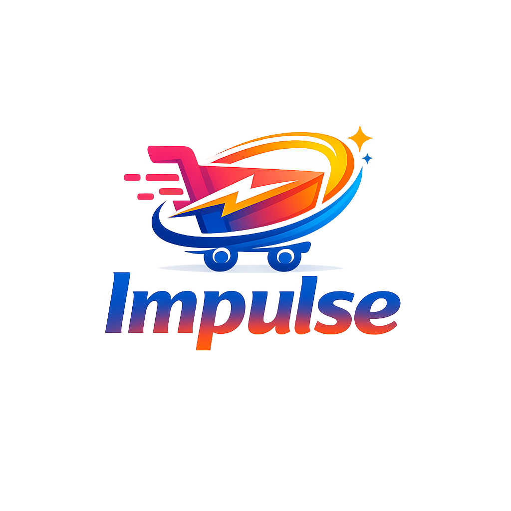

  

 

**Projeto desenvolvido para ajudar vendedores a melhorar sua presença no e-commerce e nos marketplaces.**

 

**💡 Sobre o projeto**

A **Impulse** é uma proposta de plataforma que reúne:

- 🎓 Mentorias para vendedores
- 🤖 Edição de imagens com IA
- 📈 Estratégias de vendas
- 🛒 Suporte para marketplaces

O objetivo do projeto é apresentar essas soluções de forma simples, clara e atrativa.

 

**🛠️ Tecnologias utilizadas**

- HTML5
- CSS3

 

**🎯 Objetivo**

Este projeto foi desenvolvido como parte dos meus estudos em Desenvolvimento Front-End, colocando em prática conceitos de HTML, CSS, organização de páginas e criação de interfaces.

 

**📌 Status**

🚧 Projeto em desenvolvimento.

Novas funcionalidades e melhorias visuais serão adicionadas futuramente.

---

**Desenvolvido por Julia Hungria 💜**
